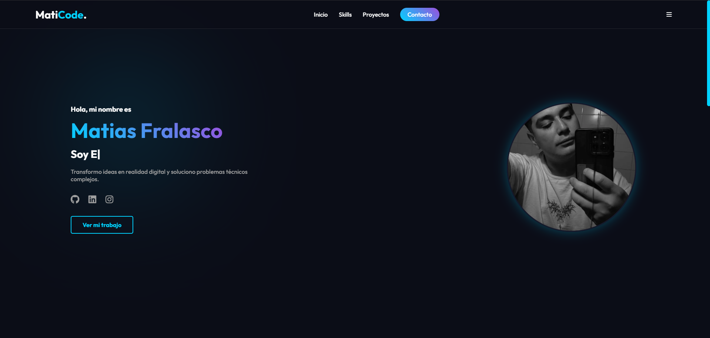

# 🚀 Portfolio Profesional | MatiCode

Bienvenido a mi portfolio personal. Este proyecto es una presentación interactiva y moderna diseñada para mostrar mis habilidades técnicas, experiencia y proyectos destacados.

El diseño sigue una estética **Cyberpunk Minimalista** con efectos de Glassmorphism (vidrio), luces de neón y animaciones fluidas.

## 🌟 Características Principales

* **⚡ Performance:** Carga rápida y optimizada sin frameworks pesados.
* **🎨 UI/UX Moderna:** Modo oscuro nativo, gradientes neón y tarjetas con efecto de vidrio.
* **📱 Diseño Responsivo:** Se adapta perfectamente a celulares, tablets y escritorio.
* **✨ Interactividad:**
    * Efecto de escritura automática (Typewriter).
    * Animaciones al hacer scroll (Fade-in / Slide-up).
    * Efecto 3D interactivo en las tarjetas de proyectos (Tilt effect).

## 🛠️ Tecnologías Utilizadas

El proyecto fue construido utilizando estándares modernos de desarrollo web:

* **HTML5** **Estructura Semántica**
* **CSS3** **Estilos & Animaciones** (Flexbox, Grid, Variables CSS)
* **JavaScript** **Lógica e Interactividad**

### 📚 Librerías Externas
* [AOS (Animate On Scroll)](https://michalsnik.github.io/aos/) - Para animaciones de entrada.
* [Typed.js](https://github.com/mattboldt/typed.js/) - Para el efecto de escritura en el hero.
* [Vanilla-Tilt.js](https://micku7zu.github.io/vanilla-tilt.js/) - Para el efecto 3D en las tarjetas.
* [FontAwesome](https://fontawesome.com/) - Para los iconos vectoriales.

## 📸 Capturas de Pantalla


## 🚀 Instalación y Uso

Este proyecto no requiere instalación de dependencias complejas (como Node.js o NPM) para visualizarse.

1.  **Clonar el repositorio:**
    ```bash
    git clone [https://github.com/tu-usuario/mi-portfolio.git](https://github.com/tu-usuario/mi-portfolio.git)
    ```
2.  **Abrir el proyecto:**
    Navega a la carpeta y abre el archivo `index.html` en tu navegador favorito.
    
    *Recomendación:* Si usas VS Code, instala la extensión "Live Server" y haz clic en "Go Live" para ver los cambios en tiempo real.

## 🎨 Personalización

Si quieres usar este template para tu propio portfolio:

1.  **Imágenes:** Reemplaza los archivos en la carpeta `/img`.
    * `perfil.png` -> Tu foto.
    * `proyectoX.jpg` -> Capturas de tus trabajos.
2.  **Textos:** Edita el archivo `index.html`.
3.  **Colores:** Ve al archivo `style.css` y modifica las variables en `:root`:
    ```css
    :root {
        --main-color: #00d2ff; /* Tu color principal */
        --accent-color: #9d4edd; /* Tu color secundario */
    }
    ```

## 🌐 Deploy

Este proyecto está listo para ser desplegado gratuitamente en:
* [GitHub Pages](https://pages.github.com/)
* [Netlify](https://www.netlify.com/)
* [Vercel](https://vercel.com/)

## 📞 Contacto

**Matias Fralasco** - Desarrollador Web & Técnico.

* [LinkedIn](https://linkedin.com/in/matiasfralasco)
* [GitHub](https://github.com/matiasfralasco)
* Email: matutefralas@gmail.com

---
Hecho con ❤️ y mucho código.